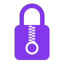

# ZipLock Password Manager

<div align="center">
  
  
  **A secure, portable password manager using encrypted 7z archives**
  
  [](LICENSE.md)
  [](https://github.com/ejangi/ziplock/actions)
  [](docs/architecture.md#security-architecture)
</div>

## Table of Contents

- [Overview](#overview)
- [Key Features](#key-features)
- [User Experience](#user-experience)
- [Platform Support](#platform-support)
- [Architecture](#architecture)
- [Getting Started](#getting-started)
- [Documentation](#documentation)
- [Contributing](#contributing)
- [License](#license)
- [Support](#support)

## 🔐 Overview

ZipLock is a modern, secure password manager that stores your credentials in a single encrypted 7z archive file. Built with a focus on security, portability, and user control, ZipLock ensures your sensitive data remains encrypted and under your complete control.

Unlike cloud-based password managers, ZipLock gives you full ownership of your data. Your encrypted password database is a single file that you can store anywhere - on your local drive, in your preferred cloud storage service, or on a USB drive. This approach provides maximum flexibility while maintaining the highest security standards.

### Why ZipLock?

- **🔒 Your Data, Your Control**: No cloud dependencies, no vendor lock-in
- **📦 True Portability**: Single encrypted file you can store anywhere
- **🛡️ Zero Knowledge**: Your master key never leaves your device
- **🔓 Open Source**: Fully auditable code under Apache 2.0 license
- **🌐 Cross-Platform**: Native apps for all major platforms

## ✨ Key Features

### Security First
- **AES-256 Encryption**: Military-grade encryption with robust key derivation using Argon2
- **Secure Memory Management**: Master key stored only in memory, never persisted to disk
- **Auto-Lock Protection**: Configurable timeout to automatically lock your vault
- **File Locking**: Prevents concurrent access and data corruption during sync operations

### Powerful Organization
- **Full-Text Search**: Search across all credential fields instantly
- **Smart Tagging**: Organize credentials with custom tags for easy filtering
- **Custom Field Types**: Create your own credential templates with any combination of fields
- **Built-in Templates**: Pre-configured templates for logins, credit cards, secure notes, and more

### Modern User Experience
- **Clean, Flat Design**: Modern interface with dark/light theme support
- **TOTP Generation**: Built-in two-factor authentication code generation
- **Password Generator**: Create strong, customizable passwords
- **Browser Integration**: Seamless auto-fill through browser extensions
- **Import/Export**: Easy migration from other password managers

### Advanced Features
- **Version History**: Track and restore previous versions of credentials
- **Configurable Compression**: Advanced 7z compression with solid compression and multi-threading
- **Backup Management**: Automatic backup rotation with configurable retention
- **Cross-Device Sync**: Use any file sync service (Dropbox, OneDrive, iCloud, etc.)

## 🎯 User Experience

ZipLock is designed to be intuitive and efficient for both new users and power users:

### First-Time Setup
1. **Create Your Vault**: Choose a strong master passphrase with real-time strength validation
2. **Select Storage Location**: Pick where to store your encrypted database file
3. **Import Existing Data**: Easily migrate from other password managers (optional)

### Daily Usage
- **Quick Access**: Fast unlock with master passphrase
- **Instant Search**: Find credentials as you type
- **One-Click Actions**: Copy passwords, usernames, and TOTP codes with a single click
- **Auto-Fill**: Browser extensions provide seamless login automation

### Advanced Management
- **Custom Templates**: Create credential types that match your specific needs
- **Bulk Operations**: Tag, organize, and manage multiple credentials at once
- **Security Monitoring**: Password strength analysis and duplicate detection
- **Audit Trail**: Track when credentials were last accessed or modified

## 📱 Platform Support

ZipLock follows a client-server architecture with native applications for each platform:

| Platform | Status | Technology | Features |
|----------|--------|------------|----------|
| **Linux** | ✅ Stable | Rust + iced/GTK4 | Full desktop experience, Wayland support |
| **Windows** | 🚧 In Development | Rust + Tauri | Native Windows integration |
| **iOS** | 🚧 In Development | Swift + SwiftUI | iOS-native backend service |
| **Android** | 🚧 In Development | Kotlin + Jetpack Compose | Android-native backend service |
| **macOS** | 📋 Planned | Swift + SwiftUI | Native macOS experience |

### Architecture Benefits
- **Thin Clients**: Lightweight, responsive user interfaces
- **Secure Backend**: All cryptographic operations handled by secure backend service
- **Consistent Experience**: Shared data models ensure consistency across platforms
- **Platform Native**: Each client uses platform-specific technologies for optimal performance

## 🏗️ Architecture

ZipLock follows a secure client-server architecture designed for maximum security and portability:

```
┌─────────────────┐    IPC     ┌─────────────────┐    File I/O    ┌─────────────────┐
│  Frontend UI    │ ◄──────────► │ Backend Service │ ◄─────────────► │ Encrypted 7z    │
│  (Platform      │             │ (Rust/Swift/    │               │ Archive         │
│   Native)       │             │  Kotlin)        │               │                 │
└─────────────────┘             └─────────────────┘               └─────────────────┘
        │                               │
        │                               │
        └─────────────┬─────────────────┘
                      │
              ┌─────────────────┐
              │ Shared Library  │
              │ (Data Models &  │
              │  Utilities)     │
              └─────────────────┘
```

### Key Architectural Principles
- **Separation of Concerns**: UI and cryptography are completely separated
- **Zero Trust Frontend**: Frontend clients are treated as untrusted components
- **Secure Communication**: All sensitive operations happen in the backend
- **Modular Design**: Shared components enable consistent behavior across platforms

## 🚀 Getting Started

### Quick Installation

**Linux (Ubuntu/Debian)**:
```bash
wget -O- https://github.com/ejangi/ziplock/releases/latest/download/ziplock_amd64.deb
sudo dpkg -i ziplock_amd64.deb
```

**Windows**: Not yet available - Windows implementation is currently in development

**iOS**: Available on the App Store (coming soon)

**Android**: Available on Google Play Store (coming soon)

### Building from Source

#### Prerequisites
- **Rust**: 1.70+ with Cargo
- **System Dependencies**: Platform-specific GUI toolkit dependencies

#### Build Steps
```bash
# Clone the repository
git clone https://github.com/ejangi/ziplock.git
cd ziplock

# Build the backend service
cargo build --release --bin ziplock-backend

# Build the frontend (Linux example)
cargo build --release --bin ziplock --manifest-path frontend/linux/Cargo.toml

# Run ZipLock
./target/release/ziplock-backend &
./target/release/ziplock
```

For detailed build instructions, see the [development documentation](docs/development.md).

### Configuration

ZipLock can be customized through configuration files:

**Linux**: `~/.config/ziplock/config.yml`  
**Windows**: `%APPDATA%/ZipLock/config.yml`

Example configuration:
```yaml
storage:
  backup_count: 5
  auto_backup: true
  compression:
    level: 6
    solid: false
    multi_threaded: true

security:
  auto_lock_timeout: 900  # 15 minutes
  min_master_key_length: 12
  enforce_strong_master_key: true

ui:
  theme: "auto"  # auto, light, dark
  font_size: 14
  show_password_strength: true
```

## 📖 Documentation

### User Documentation
- [User Guide](docs/user-guide.md) - Complete guide to using ZipLock
- [Security Model](docs/security.md) - Understanding ZipLock's security approach
- [FAQ](docs/faq.md) - Frequently asked questions

### Technical Documentation
- [Architecture Overview](docs/architecture.md) - Detailed system architecture
- [Design Guidelines](docs/design.md) - UI/UX design principles
- [API Documentation](docs/api.md) - Backend service API reference
- [Repository Detection Implementation](docs/repository-detection-implementation.md) - Technical implementation details

### Developer Documentation
- [Development Guide](docs/development.md) - Setting up the development environment
- [Contributing Guidelines](docs/contributing.md) - How to contribute to ZipLock
- [Build Instructions](docs/build.md) - Platform-specific build instructions

## 🤝 Contributing

We welcome contributions to ZipLock! Whether you're fixing bugs, adding features, improving documentation, or helping with translations, your help is appreciated.

### Ways to Contribute
- **Code**: Submit pull requests for bug fixes and new features
- **Documentation**: Help improve user and developer documentation
- **Testing**: Report bugs and help test new features
- **Design**: Contribute to UI/UX improvements
- **Translation**: Help translate ZipLock to new languages

### Getting Started
1. Read our [Contributing Guidelines](docs/contributing.md)
2. Check out [good first issues](https://github.com/ejangi/ziplock/labels/good%20first%20issue)
3. Join our [discussions](https://github.com/ejangi/ziplock/discussions) to connect with the community

### Development Setup
```bash
# Fork and clone the repository
git clone https://github.com/ejangi/ziplock.git
cd ziplock

# Install dependencies and build
cargo build

# Run tests
cargo test

# Start development servers
./scripts/dev-setup.sh
```

## 📄 License

ZipLock is licensed under the [Apache License 2.0](LICENSE.md). This means you can:
- ✅ Use it commercially
- ✅ Modify and distribute it
- ✅ Include it in proprietary software
- ✅ Use it privately

The Apache 2.0 license provides strong protection for both users and contributors while ensuring the software remains free and open source.

## 🙏 Acknowledgments

ZipLock is built on the shoulders of giants:

- **[7-Zip](https://www.7-zip.org/)** - For the excellent archive format and compression algorithms
- **[sevenz-rust2](https://github.com/hasenbanck/sevenz-rust2)** - Pure Rust implementation of 7z format
- **[Iconoir](https://iconoir.com/)** - Beautiful free SVG icons used throughout the UI
- **Rust Community** - For excellent cryptography and systems programming crates
- **Contributors** - Everyone who has contributed code, documentation, and feedback

## 📞 Support

### Getting Help
- **Documentation**: Check our comprehensive [documentation](docs/)
- **Community Discussions**: Join [GitHub Discussions](https://github.com/ejangi/ziplock/discussions)
- **Issue Tracker**: Report bugs on [GitHub Issues](https://github.com/ejangi/ziplock/issues)

### Security
If you discover a security vulnerability, please follow our [Security Policy](SECURITY.md) for responsible disclosure.

### Professional Support
For enterprise deployments and professional support, contact James Angus at [james@ejangi.com](mailto:james@ejangi.com).

---

<div align="center">
  <p>Made with ❤️ by James Angus <james@ejangi.com></p>
  <p>🔐 Your security is our priority 🔐</p>
</div>