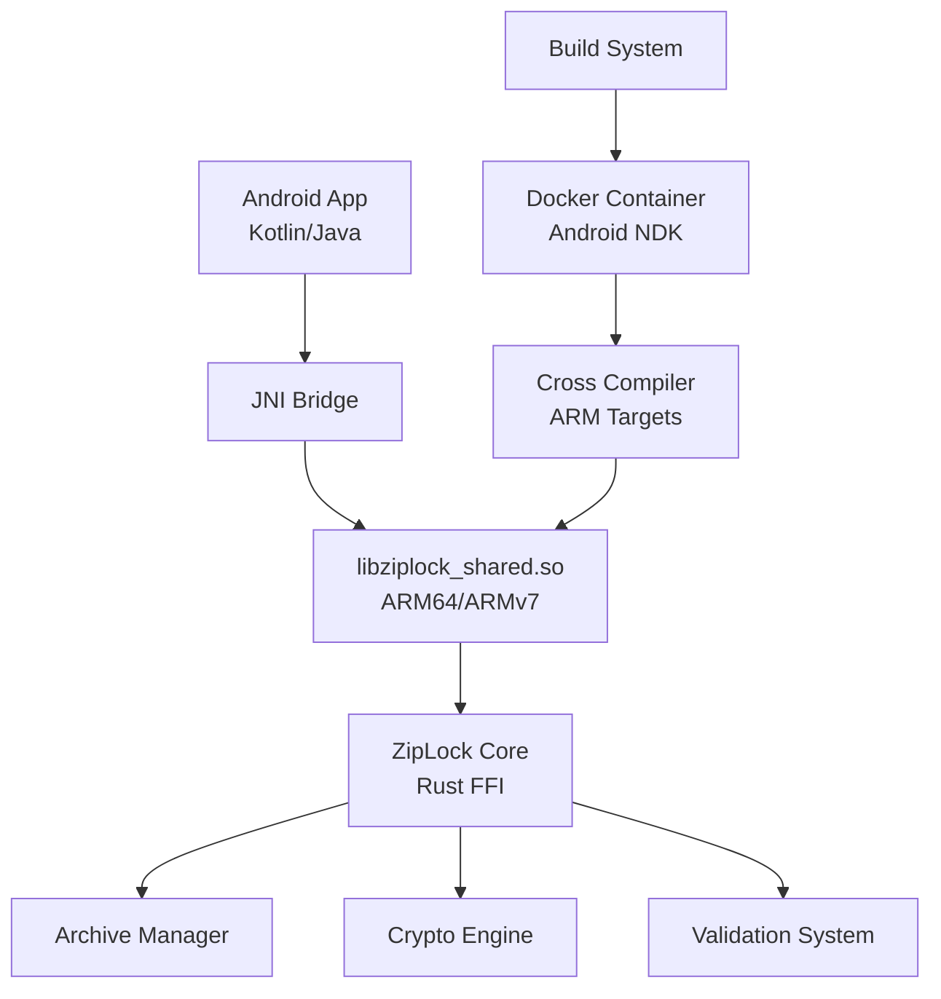

# ZipLock Android Development Guide

This document provides comprehensive guidance for setting up, building, and deploying ZipLock's shared libraries for Android ARM platforms. It covers the current implementation status, build processes, Docker-based development environments, and troubleshooting.

## Table of Contents

- [Current Implementation Status](#current-implementation-status)
- [Architecture Overview](#architecture-overview)
- [Android ARM Compilation Setup](#android-arm-compilation-setup)
- [Docker-based Build Environment](#docker-based-build-environment)
- [Build Process](#build-process)
- [Testing and Validation](#testing-and-validation)
- [Android Integration](#android-integration)
- [Troubleshooting](#troubleshooting)
- [Performance Considerations](#performance-considerations)
- [Security Considerations](#security-considerations)

## Current Implementation Status

✅ **Already Implemented:**
- Complete C FFI interface (`shared/src/ffi.rs`)
- C header file with comprehensive API (`shared/include/ziplock.h`)
- Mobile build script (`scripts/build/build-mobile.sh`)
- Android NDK configuration and cross-compilation setup
- Support for multiple Android architectures:
  - ARM64 (aarch64-linux-android) - Primary target
  - ARMv7 (armv7-linux-androideabi) - Legacy support
  - x86_64/x86 - Emulator support

✅ **Validated Components:**
- Rust shared library builds as `cdylib` for FFI
- Cross-compilation toolchain configuration
- JNI-compatible library output format
- Memory management and string handling for mobile

🔄 **Areas for Enhancement:**
- Docker-based build environment for consistent compilation
- Automated testing for ARM-specific functionality
- Performance optimization for mobile devices
- Enhanced error handling and logging for mobile debugging

## Architecture Overview



The ZipLock Android implementation uses a layered architecture where the Android app communicates with the Rust core library through JNI (Java Native Interface). The shared library is compiled for specific ARM architectures and packaged with the Android application.

## Android ARM Compilation Setup

### Prerequisites

1. **Rust Toolchain with Android Targets**
```bash
# Install Android targets
rustup target add aarch64-linux-android    # ARM64 (primary)
rustup target add armv7-linux-androideabi  # ARMv7 (legacy)
rustup target add x86_64-linux-android     # Emulator
rustup target add i686-linux-android       # Emulator
```

2. **Android NDK**
```bash
# Method 1: Via Android Studio
# Install through Android Studio SDK Manager
# Location: $HOME/Android/Sdk/ndk/<version>

# Method 2: Direct Download
# Download from: https://developer.android.com/ndk/downloads
# Extract to desired location

# Set environment variable
export ANDROID_NDK_HOME=$HOME/Android/Sdk/ndk/25.2.9519653
```

3. **Cross-compilation Configuration**
```bash
# Create cargo config for Android
mkdir -p ~/.cargo
cat >> ~/.cargo/config.toml << 'EOF'
[target.aarch64-linux-android]
ar = "aarch64-linux-android-ar"
linker = "aarch64-linux-android21-clang"

[target.armv7-linux-androideabi]
ar = "arm-linux-androideabi-ar"
linker = "armv7a-linux-androideabi21-clang"

[target.x86_64-linux-android]
ar = "x86_64-linux-android-ar"
linker = "x86_64-linux-android21-clang"

[target.i686-linux-android]
ar = "i686-linux-android-ar"
linker = "i686-linux-android21-clang"
EOF
```

### Dependency Compatibility

All major dependencies have been verified for ARM compatibility:

- ✅ **sevenz-rust2**: Pure Rust, cross-platform compatible
- ✅ **serde/serde_yaml**: Well-tested on ARM platforms
- ✅ **tokio**: Full ARM support with async runtime
- ✅ **crypto dependencies** (sha2, hmac): ARM-optimized implementations
- ✅ **libc**: Platform-specific bindings work correctly

## Docker-based Build Environment

To ensure consistent builds across different development environments, we provide Docker-based Android compilation.

### Quick Start with Docker

```bash
# Build everything in Docker (recommended)
./scripts/build/build-android-docker.sh all

# Or step by step
./scripts/build/build-android-docker.sh image
./scripts/build/build-android-docker.sh build
```

### Android Builder Dockerfile

Location: `.github/docker/android-builder.Dockerfile`

This Dockerfile creates a consistent build environment with:
- Ubuntu 22.04 base
- Rust toolchain with Android targets
- Android NDK 25.2.9519653
- Pre-configured cross-compilation settings

## Build Process

### Option 1: Native Build (Requires NDK Setup)

```bash
# Build all Android architectures
./scripts/build/build-mobile.sh android

# Build specific architecture
cd ziplock/shared
cargo build --release --target aarch64-linux-android --features c-api
```

### Option 2: Docker Build (Recommended)

```bash
# Build all architectures in Docker
./scripts/build/build-android-docker.sh build

# Build specific architecture
./scripts/build/build-android-docker.sh build arm64

# Test built libraries
./scripts/build/build-android-docker.sh test
```

### Build Output Structure

```
android-builds/
├── arm64-v8a/
│   └── libziplock_shared.so    # ARM64 library
├── armeabi-v7a/
│   └── libziplock_shared.so    # ARMv7 library
├── x86_64/
│   └── libziplock_shared.so    # x86_64 emulator
├── x86/
│   └── libziplock_shared.so    # x86 emulator
└── ziplock.h                   # C header file
```

## Testing and Validation

### 1. Cross-compilation Test

```bash
# Test that all targets compile successfully
./scripts/build/test-android-compilation.sh
```

### 2. Library Symbol Verification

```bash
# Verify exported symbols in built libraries
./scripts/build/verify-android-symbols.sh
```

### 3. Integration Testing

```bash
# Run comprehensive integration tests
./scripts/build/test-android-integration.sh
```

## Android Integration

### JNI Wrapper Example

```kotlin
// File: app/src/main/java/com/example/ziplock/ZipLockNative.kt
package com.example.ziplock

class ZipLockNative {
    companion object {
        init {
            System.loadLibrary("ziplock_shared")
        }
    }
    
    // Library management
    external fun init(): Int
    external fun getVersion(): String
    external fun getLastError(): String
    
    // Memory management
    external fun stringFree(ptr: Long)
    external fun credentialFree(ptr: Long)
    
    // Credential management
    external fun credentialNew(title: String, type: String): Long
    external fun credentialFromTemplate(template: String, title: String): Long
    external fun credentialAddField(
        credential: Long,
        name: String,
        fieldType: Int,
        value: String,
        label: String?,
        sensitive: Boolean
    ): Int
    external fun credentialGetField(credential: Long, fieldName: String): String?
    
    // Password utilities
    external fun passwordGenerate(
        length: Int,
        uppercase: Boolean,
        lowercase: Boolean,
        numbers: Boolean,
        symbols: Boolean
    ): String?
    
    // Validation
    external fun emailValidate(email: String): Boolean
    external fun urlValidate(url: String): Boolean
    
    // Testing
    external fun testEcho(input: String): String?
}
```

### Android Application Integration

```kotlin
// File: app/src/main/java/com/example/ziplock/ZipLockManager.kt
package com.example.ziplock

class ZipLockManager {
    private val native = ZipLockNative()
    private var initialized = false
    
    fun initialize(): Boolean {
        if (!initialized) {
            val result = native.init()
            initialized = result == 0
            if (!initialized) {
                val error = native.getLastError()
                throw RuntimeException("Failed to initialize ZipLock: $error")
            }
        }
        return initialized
    }
    
    fun getVersion(): String {
        return native.getVersion()
    }
    
    fun createCredential(title: String, type: String = "login"): Credential? {
        val ptr = native.credentialNew(title, type)
        return if (ptr != 0L) Credential(ptr, native) else null
    }
    
    fun generatePassword(
        length: Int = 16,
        includeUppercase: Boolean = true,
        includeLowercase: Boolean = true,
        includeNumbers: Boolean = true,
        includeSymbols: Boolean = true
    ): String? {
        return native.passwordGenerate(length, includeUppercase, includeLowercase, includeNumbers, includeSymbols)
    }
    
    fun validateEmail(email: String): Boolean {
        return native.emailValidate(email)
    }
    
    fun validateUrl(url: String): Boolean {
        return native.urlValidate(url)
    }
}

class Credential(private val ptr: Long, private val native: ZipLockNative) {
    fun addField(name: String, value: String, fieldType: FieldType = FieldType.TEXT, sensitive: Boolean = false): Boolean {
        return native.credentialAddField(ptr, name, fieldType.value, value, null, sensitive) == 0
    }
    
    fun getField(name: String): String? {
        return native.credentialGetField(ptr, name)
    }
    
    protected fun finalize() {
        native.credentialFree(ptr)
    }
}

enum class FieldType(val value: Int) {
    TEXT(0),
    PASSWORD(1),
    EMAIL(2),
    URL(3),
    USERNAME(4),
    PHONE(5),
    CREDIT_CARD_NUMBER(6),
    EXPIRY_DATE(7),
    CVV(8),
    TOTP_SECRET(9),
    TEXT_AREA(10),
    NUMBER(11),
    DATE(12),
    CUSTOM(13)
}
```

### Jetpack Compose Integration Example

```kotlin
// File: app/src/main/java/com/example/ziplock/ui/CredentialForm.kt
@Composable
fun CredentialForm() {
    val zipLockManager = remember { ZipLockManager() }
    var title by remember { mutableStateOf("") }
    var username by remember { mutableStateOf("") }
    var password by remember { mutableStateOf("") }
    var generatedPassword by remember { mutableStateOf("") }
    
    LaunchedEffect(Unit) {
        zipLockManager.initialize()
    }
    
    Column(
        modifier = Modifier.padding(16.dp),
        verticalArrangement = Arrangement.spacedBy(16.dp)
    ) {
        Text(
            text = "ZipLock ${zipLockManager.getVersion()}",
            style = MaterialTheme.typography.headlineMedium
        )
        
        OutlinedTextField(
            value = title,
            onValueChange = { title = it },
            label = { Text("Title") },
            modifier = Modifier.fillMaxWidth()
        )
        
        OutlinedTextField(
            value = username,
            onValueChange = { username = it },
            label = { Text("Username") },
            isError = username.isNotEmpty() && !zipLockManager.validateEmail(username),
            modifier = Modifier.fillMaxWidth()
        )
        
        OutlinedTextField(
            value = password,
            onValueChange = { password = it },
            label = { Text("Password") },
            visualTransformation = PasswordVisualTransformation(),
            modifier = Modifier.fillMaxWidth()
        )
        
        Row(
            modifier = Modifier.fillMaxWidth(),
            horizontalArrangement = Arrangement.spacedBy(8.dp)
        ) {
            Button(
                onClick = {
                    generatedPassword = zipLockManager.generatePassword(16) ?: ""
                    password = generatedPassword
                },
                modifier = Modifier.weight(1f)
            ) {
                Text("Generate Password")
            }
        }
        
        Button(
            onClick = {
                val credential = zipLockManager.createCredential(title)
                credential?.apply {
                    addField("username", username, FieldType.USERNAME)
                    addField("password", password, FieldType.PASSWORD, sensitive = true)
                }
            },
            modifier = Modifier.fillMaxWidth(),
            enabled = title.isNotEmpty() && username.isNotEmpty() && password.isNotEmpty()
        ) {
            Text("Save Credential")
        }
    }
}
```

## Troubleshooting

### Common Build Issues

1. **NDK Not Found**
```bash
# Error: Android NDK not found
# Solution: Set ANDROID_NDK_HOME environment variable
export ANDROID_NDK_HOME=$HOME/Android/Sdk/ndk/25.2.9519653
```

2. **Linker Errors**
```bash
# Error: linker `aarch64-linux-android21-clang` not found
# Solution: Add NDK toolchain to PATH
export PATH="$ANDROID_NDK_HOME/toolchains/llvm/prebuilt/linux-x86_64/bin:$PATH"
```

3. **Missing Target**
```bash
# Error: target 'aarch64-linux-android' is not installed
# Solution: Install Android targets
rustup target add aarch64-linux-android armv7-linux-androideabi
```

4. **Library Loading Errors**
```bash
# Error: UnsatisfiedLinkError when loading library
# Solution: Verify library architecture matches device
# Check that libraries are in correct jniLibs folders
```

### ARM-Specific Issues

1. **Performance Issues on ARM**
   - Use release builds: `cargo build --release`
   - Enable link-time optimization in Cargo.toml
   - Profile critical functions for ARM-specific bottlenecks

2. **Memory Alignment Issues**
   - The Rust compiler handles ARM alignment automatically
   - Ensure C structs use proper alignment attributes
   - Test on both ARMv7 and ARM64 devices

3. **Floating Point Issues**
   - ARMv7 may have different floating-point behavior
   - Use consistent precision in cryptographic calculations
   - Test mathematical operations across architectures

### Debugging Tips

1. **Enable Debug Logging**
```kotlin
// In Android app
ZipLockNative().debugLogging(true)
```

2. **Use Android Logcat**
```bash
# Filter for native crashes
adb logcat | grep -E "(FATAL|native:|crash)"
```

3. **Test in Emulator First**
```bash
# Build for x86_64 emulator
cargo build --release --target x86_64-linux-android --features c-api
```

4. **Memory Debugging**
```bash
# Use AddressSanitizer for debugging (development builds only)
export RUSTFLAGS="-Zsanitizer=address"
cargo build --target aarch64-linux-android --features c-api
```

## Performance Considerations

### Build Optimizations

1. **Release Profile Tuning**
```toml
# In Cargo.toml
[profile.release]
opt-level = 3
lto = true
codegen-units = 1
panic = "abort"
strip = true
```

2. **Mobile-Specific Optimizations**
```toml
# Mobile profile for smaller binary size
[profile.mobile]
inherits = "release"
opt-level = "s"  # Optimize for size
lto = "thin"     # Faster linking
```

3. **Feature Flags for Mobile**
```bash
# Build with minimal features for mobile
cargo build --release --target aarch64-linux-android \
    --features c-api \
    --no-default-features
```

### Runtime Performance

1. **Memory Management**
   - Use memory pools for frequent allocations
   - Minimize string conversions between Rust and JNI
   - Cache frequently accessed data

2. **Threading Considerations**
   - Tokio runtime is single-threaded on mobile by default
   - Use thread pool for CPU-intensive operations
   - Avoid blocking the main Android thread

3. **Battery Optimization**
   - Minimize background processing
   - Use efficient data structures
   - Batch operations when possible

### ARM-Specific Optimizations

1. **NEON SIMD Support**
```rust
// Enable NEON optimizations in Cargo.toml
[target.aarch64-linux-android]
rustflags = ["-C", "target-feature=+neon"]
```

2. **Architecture-Specific Features**
```toml
# Enable specific CPU features for ARM
[target.aarch64-linux-android]
rustflags = ["-C", "target-cpu=cortex-a55"]
```

### Library Size Optimization

```toml
# Optimize for size in Cargo.toml
[profile.release]
opt-level = "s"           # Optimize for size
lto = true               # Link-time optimization
codegen-units = 1        # Better optimization
panic = "abort"          # Smaller panic handling
strip = true             # Remove debug symbols
```

### Runtime Performance

1. **Lazy Loading**: Only initialize heavy components when needed
2. **Memory Pooling**: Reuse allocated memory where possible
3. **Async Operations**: Use Tokio runtime efficiently
4. **Caching**: Cache frequently accessed data

## Security Considerations

### ARM-Specific Security

1. **Address Space Layout Randomization (ASLR)**
   - Enabled by default on modern Android
   - Ensure position-independent code (PIC)

2. **Hardware Security Features**
   - ARM TrustZone support
   - Hardware RNG when available

3. **Stack Protection**
```rust
// Enable stack protection
#[cfg(target_arch = "aarch64")]
use stack_protection::enable_stack_guard;
```

### Android Security Model

1. **App Sandbox**: Libraries run within app sandbox
2. **SELinux**: Respect SELinux policies
3. **Permissions**: Minimize required permissions
4. **Key Storage**: Use Android Keystore when possible

### Memory Security

1. **Secure Memory Clearing**
```rust
use zeroize::Zeroize;

fn clear_sensitive_data(data: &mut [u8]) {
    data.zeroize();
}
```

2. **Buffer Overflow Protection**
   - Use safe Rust patterns
   - Validate all input parameters
   - Use checked arithmetic operations

## Continuous Integration

### GitHub Actions Integration

Add to `.github/workflows/android.yml`:

```yaml
name: Android Build

on:
  push:
    branches: [ main, develop ]
  pull_request:
    branches: [ main ]

jobs:
  android-build:
    runs-on: ubuntu-latest
    
    steps:
    - uses: actions/checkout@v4
    
    - name: Build Android Libraries
      run: |
        chmod +x scripts/build/build-android-docker.sh
        ./scripts/build/build-android-docker.sh build
    
    - name: Test Libraries
      run: ./scripts/build/build-android-docker.sh test
    
    - name: Upload Artifacts
      uses: actions/upload-artifact@v4
      with:
        name: android-libraries
        path: android-builds/
```

## Future Enhancements

### Planned Improvements

1. **Better Testing Infrastructure**
   - Automated ARM device testing
   - Performance regression testing
   - Memory usage profiling

2. **Enhanced Integration**
   - Kotlin coroutines support
   - Jetpack Compose-specific utilities
   - Better error handling patterns

3. **Performance Optimization**
   - NEON SIMD optimizations
   - Custom memory allocators
   - Lazy loading patterns

4. **Developer Experience**
   - Android Studio plugin
   - Better debugging tools
   - Documentation improvements

### Version Compatibility

Current Build target: Android API 21+ (Android 5.0)
- Covers 95%+ of active Android devices
- Balances feature support with compatibility

Future consideration: Android API 24+ for additional security features

## References

- [Android NDK Guide](https://developer.android.com/ndk/guides)
- [Rust Cross-compilation](https://rust-lang.github.io/rustup/cross-compilation.html)
- [JNI Specification](https://docs.oracle.com/javase/8/docs/technotes/guides/jni/)
- [Android App Bundle](https://developer.android.com/guide/app-bundle)

---

This document is maintained as part of the ZipLock technical documentation. For updates or questions, please refer to the main project repository.