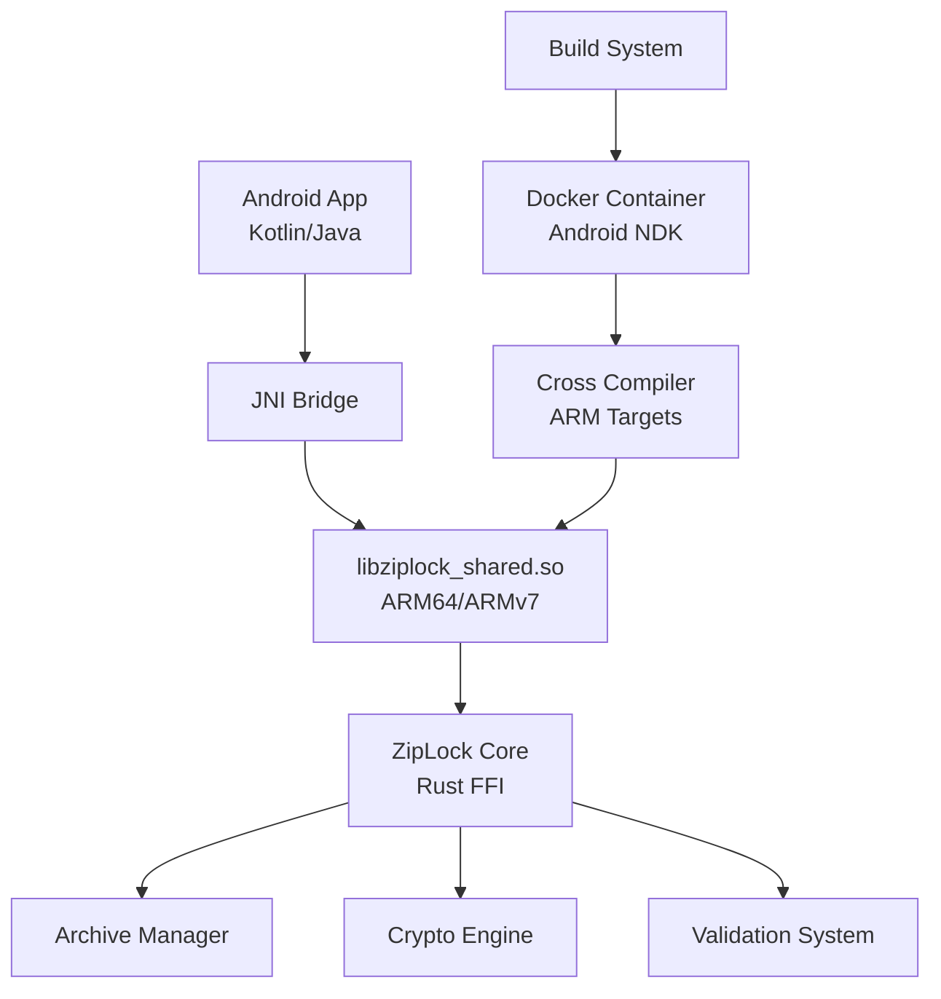

# ZipLock Android Development Guide

This comprehensive guide covers Android app development, native library compilation, setup procedures, and integration patterns for the ZipLock secure password manager.

## Table of Contents

- [Overview](#overview)
- [Quick Start (5 Minutes)](#quick-start-5-minutes)
- [Development Setup](#development-setup)
- [Android App Implementation](#android-app-implementation)
- [Native Library Compilation](#native-library-compilation)
- [FFI Integration](#ffi-integration)
- [Troubleshooting](#troubleshooting)
- [Performance & Security](#performance--security)
- [Development Roadmap](#development-roadmap)

## Overview

### Current Implementation Status

✅ **Android App (Completed)**:
- Professional splash screen with ZipLock branding
- Material 3 design system with brand colors
- Jetpack Compose UI framework
- Android project structure with proper build configuration
- Security settings (backup exclusion, ProGuard)

✅ **Native Library Support (Completed)**:
- Complete C FFI interface (`shared/src/ffi.rs`)
- C header file with comprehensive API (`shared/include/ziplock.h`)
- Cross-compilation for ARM64, ARMv7, x86_64, x86
- Docker-based build environment
- Mobile build scripts

🔄 **Integration (Next Steps)**:
- JNI bridge implementation
- Password management UI
- Biometric authentication
- File system integration

### Architecture Overview



## Quick Start (5 Minutes)

### Prerequisites
- Android Studio (latest version)
- 8GB+ RAM, 6GB+ storage

### 1. Install Android Studio
Download from: https://developer.android.com/studio
- Install SDK and emulator components during setup

### 2. Verify Setup
```bash
cd ziplock/apps/mobile/android
./verify-setup.sh
```

### 3. Open Project
- Launch Android Studio
- Choose "Open an Existing Project"
- Select `ziplock/apps/mobile/android` folder
- Wait for Gradle sync

### 4. Create Emulator
- **Tools → AVD Manager**
- **Create Virtual Device** → **Pixel 7** → **Next**
- **Android 14 (API 34)** → Download if needed → **Next** → **Finish**

### 5. Run App
- Click green ▶️ **Run** button
- Select emulator
- Watch for splash screen (2.5s) → main screen

### Expected Results
- **Splash Screen**: White background, ZipLock logo, "Secure Password Manager" subtitle
- **Main Screen**: Welcome message with ZipLock branding

## Development Setup

### System Requirements

**Minimum Requirements:**
- **RAM**: 8GB (16GB recommended)
- **Storage**: 6GB for Android Studio + SDK
- **OS**: Windows 10+, macOS 10.14+, Ubuntu 18.04+

**Software Stack:**
- **Android Studio**: Hedgehog (2023.1.1) or later
- **Java**: 11-21 (Android Studio includes embedded JDK)
- **Kotlin**: 1.9.20+
- **Gradle**: 8.5+ (included)
- **Android SDK**: API 34 (target), API 24 (minimum)

### Detailed Setup Process

#### 1. Configure Android Studio JDK

**Use Embedded JDK (Recommended):**
1. **File → Settings** → **Build Tools → Gradle**
2. **Gradle JDK**: Select **"Android Studio default JDK"**
3. **Apply** and **OK**

**Alternative - Custom JDK:**
```bash
# Set JAVA_HOME (Linux/macOS)
export JAVA_HOME=/path/to/jdk-17
export PATH=$JAVA_HOME/bin:$PATH

# Windows
set JAVA_HOME=C:\Program Files\Eclipse Adoptium\jdk-17.0.8.101-hotspot
```

#### 2. Install SDK Components

**Tools → SDK Manager:**

**SDK Platforms:**
- ✅ Android 14 (API 34) - Target
- ✅ Android 7.0 (API 24) - Minimum

**SDK Tools:**
- ✅ Android SDK Build-Tools 34.0.0
- ✅ Android Emulator
- ✅ Android SDK Platform-Tools
- ✅ Intel HAXM (Intel CPUs) / Android Emulator Hypervisor Driver (AMD)

#### 3. Configure Emulator

**Performance Settings:**
- **Device**: Pixel 7 or Pixel 6
- **System Image**: Android 14 (API 34), x86_64
- **RAM**: 4096 MB (if system allows)
- **Graphics**: Hardware - GLES 2.0
- **Storage**: 6GB internal, 512MB SD card

#### 4. Build Native Libraries

```bash
# From project root
./scripts/build/build-android-docker.sh build

# Verify output
ls -la android-builds/
# Should contain: arm64-v8a/, armeabi-v7a/, x86_64/, x86/
```

### Project Structure

```
android/
├── app/
│   ├── src/main/
│   │   ├── java/com/ziplock/
│   │   │   ├── SplashActivity.kt      # Splash screen implementation
│   │   │   └── MainActivity.kt        # Main app activity (placeholder)
│   │   ├── res/
│   │   │   ├── drawable/              # Icons and graphics
│   │   │   │   └── logo.xml          # ZipLock logo vector
│   │   │   ├── values/                # Colors, strings, themes
│   │   │   │   ├── colors.xml        # ZipLock brand colors
│   │   │   │   ├── strings.xml       # App strings
│   │   │   │   └── themes.xml        # Material 3 theme
│   │   │   └── xml/                   # Config files
│   │   │       └── backup_rules.xml  # Security config
│   │   ├── jniLibs/                   # Native libraries (future)
│   │   │   ├── arm64-v8a/            # ARM64 devices
│   │   │   ├── armeabi-v7a/          # ARM32 devices
│   │   │   ├── x86_64/               # 64-bit emulator
│   │   │   └── x86/                  # 32-bit emulator
│   │   └── AndroidManifest.xml        # App configuration
│   ├── build.gradle                   # App module config
│   └── proguard-rules.pro            # Code obfuscation
├── gradle/wrapper/                    # Gradle wrapper
├── build.gradle                       # Project config
├── settings.gradle                    # Project settings
├── gradle.properties                  # Build properties
└── local.properties                   # Local SDK paths
```

## Android App Implementation

### Current Features

#### 1. Splash Screen (`SplashActivity.kt`)
```kotlin
class SplashActivity : ComponentActivity() {
    override fun onCreate(savedInstanceState: Bundle?) {
        super.onCreate(savedInstanceState)
        
        setContent {
            ZipLockTheme {
                SplashScreen(
                    onTimeout = {
                        startActivity(Intent(this@SplashActivity, MainActivity::class.java))
                        finish()
                    }
                )
            }
        }
    }
}

@Composable
fun SplashScreen(onTimeout: () -> Unit) {
    LaunchedEffect(Unit) {
        delay(2500) // 2.5 second display
        onTimeout()
    }
    
    Surface(
        modifier = Modifier.fillMaxSize(),
        color = Color.White
    ) {
        Column(
            modifier = Modifier.fillMaxSize(),
            horizontalAlignment = Alignment.CenterHorizontally,
            verticalArrangement = Arrangement.Center
        ) {
            Icon(
                painter = painterResource(id = R.drawable.logo),
                contentDescription = "ZipLock Logo",
                modifier = Modifier.size(120.dp),
                tint = MaterialTheme.colorScheme.primary
            )
            
            Spacer(modifier = Modifier.height(24.dp))
            
            Text(
                text = "ZipLock",
                style = MaterialTheme.typography.headlineLarge,
                color = MaterialTheme.colorScheme.primary,
                fontWeight = FontWeight.Bold
            )
            
            Text(
                text = "Secure Password Manager",
                style = MaterialTheme.typography.bodyLarge,
                color = MaterialTheme.colorScheme.onSurface.copy(alpha = 0.7f)
            )
            
            Spacer(modifier = Modifier.height(48.dp))
            
            Text(
                text = "Loading...",
                style = MaterialTheme.typography.bodyMedium,
                color = MaterialTheme.colorScheme.onSurface.copy(alpha = 0.5f)
            )
        }
    }
}
```

#### 2. Design System

**Brand Colors (`colors.xml`):**
```xml
<resources>
    <!-- ZipLock Brand Colors -->
    <color name="ziplock_purple">#8338EC</color>
    <color name="ziplock_purple_dark">#6425D3</color>
    
    <!-- Background Colors -->
    <color name="background_light">#F8F9FA</color>
    <color name="background_dark">#212529</color>
    
    <!-- Status Colors -->
    <color name="success">#06D6A0</color>
    <color name="error">#EF476F</color>
    <color name="warning">#FCBF49</color>
</resources>
```

**Material 3 Theme (`themes.xml`):**
```xml
<resources>
    <style name="Theme.ZipLock" parent="Theme.Material3.DayNight">
        <item name="colorPrimary">@color/ziplock_purple</item>
        <item name="colorOnPrimary">#FFFFFF</item>
        <item name="colorPrimaryContainer">@color/ziplock_purple_dark</item>
        <item name="colorBackground">@color/background_light</item>
        <item name="colorSurface">#FFFFFF</item>
    </style>
</resources>
```

#### 3. Security Configuration

**Backup Rules (`backup_rules.xml`):**
```xml
<full-backup-content>
    <!-- Exclude sensitive data from backups -->
    <exclude domain="sharedpref" path="." />
    <exclude domain="database" path="." />
    <exclude domain="file" path="." />
</full-backup-content>
```

**Data Extraction Rules:**
```xml
<data-extraction-rules>
    <cloud-backup>
        <exclude domain="sharedpref" />
        <exclude domain="database" />
        <exclude domain="file" />
    </cloud-backup>
    <device-transfer>
        <exclude domain="sharedpref" />
        <exclude domain="database" />
        <exclude domain="file" />
    </device-transfer>
</data-extraction-rules>
```

### Build Configuration

**App-level `build.gradle`:**
```gradle
android {
    namespace 'com.ziplock'
    compileSdk 34

    defaultConfig {
        applicationId "com.ziplock"
        minSdk 24
        targetSdk 34
        versionCode 1
        versionName "1.0"
    }

    buildTypes {
        release {
            minifyEnabled true
            proguardFiles getDefaultProguardFile('proguard-android-optimize.txt'), 'proguard-rules.pro'
        }
    }
    
    compileOptions {
        sourceCompatibility JavaVersion.VERSION_11
        targetCompatibility JavaVersion.VERSION_11
    }
    
    kotlinOptions {
        jvmTarget = '11'
    }
    
    buildFeatures {
        compose true
    }
    
    composeOptions {
        kotlinCompilerExtensionVersion '1.5.4'
    }
}

dependencies {
    implementation 'androidx.core:core-ktx:1.12.0'
    implementation 'androidx.lifecycle:lifecycle-runtime-ktx:2.7.0'
    implementation 'androidx.activity:activity-compose:1.8.2'
    implementation 'androidx.compose.ui:ui:1.5.4'
    implementation 'androidx.compose.material3:material3:1.1.2'
    // Additional dependencies...
}
```

## Native Library Compilation

### Android ARM Cross-Compilation Setup

#### Prerequisites

**1. Rust Toolchain with Android Targets:**
```bash
# Install Android targets
rustup target add aarch64-linux-android    # ARM64 (primary)
rustup target add armv7-linux-androideabi  # ARMv7 (legacy)
rustup target add x86_64-linux-android     # Emulator
rustup target add i686-linux-android       # Emulator
```

**2. Android NDK:**
```bash
# Method 1: Via Android Studio SDK Manager
# Location: $HOME/Android/Sdk/ndk/<version>

# Method 2: Direct Download
# From: https://developer.android.com/ndk/downloads

# Set environment variable
export ANDROID_NDK_HOME=$HOME/Android/Sdk/ndk/25.2.9519653
```

**3. Cross-compilation Configuration:**
```bash
# Create cargo config for Android
mkdir -p ~/.cargo
cat >> ~/.cargo/config.toml << 'EOF'
[target.aarch64-linux-android]
ar = "aarch64-linux-android-ar"
linker = "aarch64-linux-android21-clang"

[target.armv7-linux-androideabi]
ar = "arm-linux-androideabi-ar"
linker = "armv7a-linux-androideabi21-clang"

[target.x86_64-linux-android]
ar = "x86_64-linux-android-ar"
linker = "x86_64-linux-android21-clang"

[target.i686-linux-android]
ar = "i686-linux-android-ar"
linker = "i686-linux-android21-clang"
EOF
```

### Docker-based Build Environment (Recommended)

**Quick Start with Docker:**
```bash
# Build all architectures in Docker
./scripts/build/build-android-docker.sh build

# Test built libraries
./scripts/build/build-android-docker.sh test

# Build specific architecture
./scripts/build/build-android-docker.sh build arm64
```

**Docker Build Environment Features:**
- Ubuntu 22.04 base with Android NDK 25.2.9519653
- Rust toolchain with all Android targets pre-installed
- Consistent build environment across platforms
- Automated cross-compilation setup
- Pre-built image available from GitHub Container Registry (`ghcr.io/ejangi/ziplock/android-builder:latest`)
- Automatic fallback to local build if registry image is unavailable

### Build Process

#### Option 1: Native Build
```bash
# Build all Android architectures
./scripts/build/build-mobile.sh android

# Build specific architecture
cd shared
cargo build --release --target aarch64-linux-android --features c-api
```

#### Option 2: Docker Build (Recommended)
```bash
# Complete build process
./scripts/build/build-android-docker.sh all

# Step by step
./scripts/build/build-android-docker.sh image    # Build Docker image
./scripts/build/build-android-docker.sh build    # Compile libraries
./scripts/build/build-android-docker.sh test     # Validate output
```

### Build Output

```
android-builds/
├── arm64-v8a/
│   └── libziplock_shared.so    # ARM64 library for modern devices
├── armeabi-v7a/
│   └── libziplock_shared.so    # ARMv7 library for legacy devices
├── x86_64/
│   └── libziplock_shared.so    # 64-bit emulator support
├── x86/
│   └── libziplock_shared.so    # 32-bit emulator support
└── ziplock.h                   # C header file for JNI
```

### Performance Optimizations

**Release Profile Tuning (`Cargo.toml`):**
```toml
[profile.release]
opt-level = 3           # Maximum optimization
lto = true             # Link-time optimization
codegen-units = 1      # Better optimization
panic = "abort"        # Smaller panic handling
strip = true           # Remove debug symbols

[profile.mobile]
inherits = "release"
opt-level = "s"        # Optimize for size
lto = "thin"          # Faster linking

# ARM-specific optimizations
[target.aarch64-linux-android]
rustflags = ["-C", "target-feature=+neon"]
```

## FFI Integration

### JNI Wrapper Implementation

**ZipLockNative.kt - Core JNI Interface:**
```kotlin
package com.ziplock

class ZipLockNative {
    companion object {
        init {
            System.loadLibrary("ziplock_shared")
        }
    }
    
    // Library management
    external fun init(): Int
    external fun getVersion(): String
    external fun getLastError(): String
    
    // Memory management
    external fun stringFree(ptr: Long)
    external fun credentialFree(ptr: Long)
    
    // Credential management
    external fun credentialNew(title: String, type: String): Long
    external fun credentialFromTemplate(template: String, title: String): Long
    external fun credentialAddField(
        credential: Long,
        name: String,
        fieldType: Int,
        value: String,
        label: String?,
        sensitive: Boolean
    ): Int
    external fun credentialGetField(credential: Long, fieldName: String): String?
    
    // Password utilities
    external fun passwordGenerate(
        length: Int,
        uppercase: Boolean,
        lowercase: Boolean,
        numbers: Boolean,
        symbols: Boolean
    ): String?
    
    // Validation
    external fun emailValidate(email: String): Boolean
    external fun urlValidate(url: String): Boolean
    
    // Testing
    external fun testEcho(input: String): String?
}
```

**ZipLockManager.kt - High-level API:**
```kotlin
package com.ziplock

class ZipLockManager {
    private val native = ZipLockNative()
    private var initialized = false
    
    fun initialize(): Boolean {
        if (!initialized) {
            val result = native.init()
            initialized = result == 0
            if (!initialized) {
                val error = native.getLastError()
                throw RuntimeException("Failed to initialize ZipLock: $error")
            }
        }
        return initialized
    }
    
    fun getVersion(): String = native.getVersion()
    
    fun createCredential(title: String, type: String = "login"): Credential? {
        val ptr = native.credentialNew(title, type)
        return if (ptr != 0L) Credential(ptr, native) else null
    }
    
    fun generatePassword(
        length: Int = 16,
        includeUppercase: Boolean = true,
        includeLowercase: Boolean = true,
        includeNumbers: Boolean = true,
        includeSymbols: Boolean = true
    ): String? {
        return native.passwordGenerate(
            length, includeUppercase, includeLowercase, includeNumbers, includeSymbols
        )
    }
    
    fun validateEmail(email: String): Boolean = native.emailValidate(email)
    fun validateUrl(url: String): Boolean = native.urlValidate(url)
}

class Credential(private val ptr: Long, private val native: ZipLockNative) {
    fun addField(
        name: String, 
        value: String, 
        fieldType: FieldType = FieldType.TEXT, 
        sensitive: Boolean = false
    ): Boolean {
        return native.credentialAddField(ptr, name, fieldType.value, value, null, sensitive) == 0
    }
    
    fun getField(name: String): String? = native.credentialGetField(ptr, name)
    
    protected fun finalize() {
        native.credentialFree(ptr)
    }
}

enum class FieldType(val value: Int) {
    TEXT(0), PASSWORD(1), EMAIL(2), URL(3), USERNAME(4),
    PHONE(5), CREDIT_CARD_NUMBER(6), EXPIRY_DATE(7), CVV(8),
    TOTP_SECRET(9), TEXT_AREA(10), NUMBER(11), DATE(12), CUSTOM(13)
}
```

### Jetpack Compose UI Integration

**CredentialForm.kt - Example Implementation:**
```kotlin
@Composable
fun CredentialForm() {
    val zipLockManager = remember { ZipLockManager() }
    var title by remember { mutableStateOf("") }
    var username by remember { mutableStateOf("") }
    var password by remember { mutableStateOf("") }
    var isLoading by remember { mutableStateOf(false) }
    
    LaunchedEffect(Unit) {
        zipLockManager.initialize()
    }
    
    Column(
        modifier = Modifier
            .fillMaxSize()
            .padding(16.dp),
        verticalArrangement = Arrangement.spacedBy(16.dp)
    ) {
        Text(
            text = "ZipLock ${zipLockManager.getVersion()}",
            style = MaterialTheme.typography.headlineMedium,
            color = MaterialTheme.colorScheme.primary
        )
        
        OutlinedTextField(
            value = title,
            onValueChange = { title = it },
            label = { Text("Title") },
            modifier = Modifier.fillMaxWidth(),
            singleLine = true
        )
        
        OutlinedTextField(
            value = username,
            onValueChange = { username = it },
            label = { Text("Username/Email") },
            modifier = Modifier.fillMaxWidth(),
            isError = username.isNotEmpty() && !zipLockManager.validateEmail(username),
            supportingText = {
                if (username.isNotEmpty() && !zipLockManager.validateEmail(username)) {
                    Text("Invalid email format", color = MaterialTheme.colorScheme.error)
                }
            }
        )
        
        OutlinedTextField(
            value = password,
            onValueChange = { password = it },
            label = { Text("Password") },
            modifier = Modifier.fillMaxWidth(),
            visualTransformation = PasswordVisualTransformation(),
            trailingIcon = {
                IconButton(onClick = {
                    password = zipLockManager.generatePassword(16) ?: ""
                }) {
                    Icon(Icons.Default.Refresh, contentDescription = "Generate Password")
                }
            }
        )
        
        Row(
            modifier = Modifier.fillMaxWidth(),
            horizontalArrangement = Arrangement.spacedBy(8.dp)
        ) {
            Button(
                onClick = {
                    val generated = zipLockManager.generatePassword(20, true, true, true, true)
                    if (generated != null) password = generated
                },
                modifier = Modifier.weight(1f),
                colors = ButtonDefaults.buttonColors(
                    containerColor = MaterialTheme.colorScheme.secondary
                )
            ) {
                Text("Strong Password")
            }
            
            Button(
                onClick = {
                    val generated = zipLockManager.generatePassword(12, true, true, true, false)
                    if (generated != null) password = generated
                },
                modifier = Modifier.weight(1f),
                colors = ButtonDefaults.buttonColors(
                    containerColor = MaterialTheme.colorScheme.tertiary
                )
            ) {
                Text("Simple Password")
            }
        }
        
        Button(
            onClick = {
                isLoading = true
                val credential = zipLockManager.createCredential(title)
                credential?.apply {
                    addField("username", username, FieldType.USERNAME)
                    addField("password", password, FieldType.PASSWORD, sensitive = true)
                }
                isLoading = false
                // TODO: Navigate to success screen
            },
            modifier = Modifier.fillMaxWidth(),
            enabled = !isLoading && title.isNotEmpty() && username.isNotEmpty() && password.isNotEmpty()
        ) {
            if (isLoading) {
                CircularProgressIndicator(modifier = Modifier.size(16.dp))
            } else {
                Text("Save Credential")
            }
        }
    }
}
```

## Troubleshooting

### Common Build Issues

#### Java/Gradle Compatibility
**Problem**: Java 21 with Gradle incompatibility
```
Your build is currently configured to use incompatible Java 21.0.6 and Gradle 8.2
```
**Solution**: Project updated to Gradle 8.5 for Java 21 support
```bash
# Clear caches and rebuild
./gradlew clean
./gradlew build
```

#### Android NDK Issues
**Problem**: NDK not found
```bash
# Set NDK path
export ANDROID_NDK_HOME=$HOME/Android/Sdk/ndk/25.2.9519653
export PATH="$ANDROID_NDK_HOME/toolchains/llvm/prebuilt/linux-x86_64/bin:$PATH"
```

**Problem**: Missing Android targets
```bash
# Install all required targets
rustup target add aarch64-linux-android armv7-linux-androideabi x86_64-linux-android i686-linux-android
```

#### Library Loading Errors
**Problem**: UnsatisfiedLinkError
```kotlin
// Verify library architecture matches device
adb shell getprop ro.product.cpu.abi
// Ensure corresponding .so file exists in jniLibs/
```

### Android Studio Issues

#### Cache and Build Problems
```bash
# Method 1: Android Studio
# File → Invalidate Caches and Restart → "Invalidate and Restart"

# Method 2: Command line
cd ziplock/apps/mobile/android
rm -rf .gradle .idea build app/build
./gradlew clean build
```

#### Emulator Performance
**Slow Emulator:**
- Enable hardware acceleration (HAXM/Hypervisor Driver)
- Increase RAM allocation (4GB+)
- Use x86_64 system images instead of ARM
- Enable "Quick Boot" in AVD settings

**Emulator Won't Start:**
```bash
# Linux: Add user to kvm group
sudo usermod -a -G kvm $USER

# Windows: Enable virtualization in BIOS
# Disable Hyper-V if using Intel HAXM

# macOS: No additional setup usually required
```

### Memory and Performance Issues

#### Memory Debugging
```bash
# Use AddressSanitizer (development only)
export RUSTFLAGS="-Zsanitizer=address"
cargo build --target aarch64-linux-android --features c-api
```

#### Profiling
```bash
# Android Logcat filtering
adb logcat | grep -E "(FATAL|native:|crash|ZipLock)"

# Memory usage monitoring
adb shell dumpsys meminfo com.ziplock
```

### Native Library Integration

**Library Verification:**
```bash
# Check symbols in built library
nm -D android-builds/arm64-v8a/libziplock_shared.so | grep ziplock

# Verify architecture
file android-builds/arm64-v8a/libziplock_shared.so
```

**Runtime Debugging:**
```kotlin
// Enable debug logging in app
class ZipLockDebug {
    companion object {
        fun enableLogging() {
            System.setProperty("ziplock.debug", "true")
        }
    }
}
```

## Performance & Security

### Performance Optimizations

#### Build-time Optimizations
```toml
# Cargo.toml optimizations
[profile.release]
opt-level = 3           # Maximum optimization
lto = true             # Link-time optimization
codegen-units = 1      # Better optimization
panic = "abort"        # Smaller binaries
strip = true           # Remove debug symbols

# ARM-specific features
[target.aarch64-linux-android]
rustflags = ["-C", "target-feature=+neon", "-C", "target-cpu=cortex-a55"]
```

#### Runtime Performance
- **Memory Pools**: Reuse allocations for frequent operations
- **Lazy Loading**: Initialize components only when needed
- **Async Operations**: Use Kotlin coroutines with native calls
- **Caching**: Cache frequently accessed data

#### Battery Optimization
- Minimize background processing
- Batch operations when possible
- Use efficient data structures
- Implement proper lifecycle management

### Security Considerations

#### Android Security Model
```xml
<!-- AndroidManifest.xml security settings -->
<application
    android:allowBackup="false"
    android:dataExtractionRules="@xml/data_extraction_rules"
    android:fullBackupContent="@xml/backup_rules">
    
    <!-- Prevent screenshots in recents -->
    <activity android:name=".MainActivity"
        android:screenOrientation="portrait"
        android:exported="false" />
</application>
```

#### Memory Security
```kotlin
// Secure memory clearing
class SecureString(private var data: CharArray?) {
    fun clear() {
        data?.fill('\u0000')
        data = null
    }
    
    protected fun finalize() {
        clear()
    }
}
```

#### Native Library Security
- Position-independent code (PIC) enabled
- Stack protection enabled by default
- Address Space Layout Randomization (ASLR) support
- Hardware security features (TrustZone when available)

#### App Security Features
- Biometric authentication (planned)
- App lock timeout functionality
- Screenshot prevention in sensitive screens
- Secure keyboard integration

## Development Roadmap

### Phase 1: Core Integration (High Priority)

#### FFI Bridge Implementation
- [x] Native library compilation for Android
- [x] C header generation
- [ ] JNI wrapper classes
- [ ] Error handling and memory management
- [ ] Integration testing on physical devices

#### Authentication UI
- [ ] Repository setup screen with file picker
- [ ] Passphrase input with strength validation
- [ ] New repository creation wizard
- [ ] Biometric authentication prompt

### Phase 2: Password Management (Medium Priority)

#### Credential Management
- [ ] Credential list view with search/filter
- [ ] Credential detail/edit screens
- [ ] Add/delete credential functionality
- [ ] Category and tag organization
- [ ] Import/export capabilities

#### Advanced Features
- [ ] TOTP generation and display
- [ ] Password strength analysis
- [ ] Secure clipboard integration
- [ ] Auto-fill service integration

### Phase 3: Enhanced Features (Low Priority)

#### Settings and Configuration
- [ ] App preferences and themes
- [ ] Security settings (timeout, etc.)
- [ ] Backup and sync configuration
- [ ] About screen and version info

#### Security Enhancements
- [ ] Biometric authentication (fingerprint/face)
- [ ] App lock with timeout
- [ ] Screenshot prevention
- [ ] Secure keyboard integration
- [ ] Hardware security module integration

### Testing Strategy

#### Unit Testing
```kotlin
// Example test structure
@Test
fun testCredentialCreation() {
    val manager = ZipLockManager()
    assertTrue(manager.initialize())
    
    val credential = manager.createCredential("Test Site")
    assertNotNull(credential)
    
    assertTrue(credential.addField("username", "test@example.com", FieldType.EMAIL))
    assertEquals("test@example.com", credential.getField("username"))
}
```

#### Integration Testing
- Native library integration on multiple architectures
- File system operations and permissions
- Cross-activity navigation and state management
- Performance testing on various device configurations

#### UI Testing
```kotlin
@Test
fun testSplashScreenNavigation() {
    composeTestRule.setContent {
        ZipLockTheme {
            SplashScreen { /* navigation callback */ }
        }
    }
    
    // Verify splash screen elements
    composeTestRule.onNodeWithText("ZipLock").assertIsDisplayed()
    composeTestRule.onNodeWithText("Secure Password Manager").assertIsDisplayed()
    
    // Wait for navigation
    composeTestRule.waitForIdle()
}
```

### Version Compatibility

**Current Target**: Android API 24+ (Android 7.0)
- Covers 95%+ of active Android devices
- Balances modern features with broad compatibility
- Minimum API allows for advanced security features

**Supported Architectures**:
- ARM64 (aarch64-linux-android) - Primary for modern devices
- ARMv7 (armv7-linux-androideabi) - Legacy device support
- x86_64/x86 - Emulator and tablet support

### Useful Commands

#### Development Commands
```bash
# Build debug APK
cd ziplock/apps/mobile/android
./gradlew assembleDebug

# Install on device/emulator
./gradlew installDebug

# Run tests
./gradlew test
./gradlew connectedAndroidTest

# Clean build
./gradlew clean build
```

#### Debugging Commands
```bash
# View connected devices
adb devices

# Install APK manually
adb install app/build/outputs/apk/debug/app-debug.apk

# View logs
adb logcat | grep ZipLock

# Clear app data
adb shell pm clear com.ziplock

# Take screenshot
adb exec-out screencap -p > screenshot.png

# Monitor memory usage
adb shell dumpsys meminfo com.ziplock
```

#### Native Library Commands
```bash
# Build native libraries
./scripts/build/build-android-docker.sh build

# Test compilation
./scripts/build/build-android-docker.sh test

# Verify symbols
nm -D android-builds/arm64-v8a/libziplock_shared.so | grep ziplock

# Check architecture
file android-builds/arm64-v8a/libziplock_shared.so
```

### Resources and Documentation

#### Project Documentation
- [ZipLock Technical Documentation](../technical.md) - Main technical index
- [Design Guidelines](../design.md) - UI/UX standards and branding
- [Mobile Integration Guide](mobile-integration.md) - Cross-platform mobile patterns
- [Build Documentation](build.md) - Comprehensive build troubleshooting

#### External Resources
- [Android Developer Guide](https://developer.android.com/guide)
- [Jetpack Compose Documentation](https://developer.android.com/jetpack/compose)
- [Material 3 Design System](https://m3.material.io/)
- [Android NDK Guide](https://developer.android.com/ndk/guides)
- [Rust Cross-compilation](https://rust-lang.github.io/rustup/cross-compilation.html)
- [JNI Specification](https://docs.oracle.com/javase/8/docs/technotes/guides/jni/)

### Contributing

When contributing to the Android implementation:

1. **Follow Established Patterns**: Use existing code structure and naming conventions
2. **Test on Multiple Devices**: Verify compatibility across different Android versions and architectures
3. **Security First**: Ensure all user data handling follows security best practices
4. **Performance Conscious**: Profile code changes for memory and CPU impact
5. **Documentation**: Update this guide when adding new features or changing architecture

### Support and Troubleshooting

If you encounter issues:

1. **Check Logcat**: Use Android Studio's Logcat for detailed error messages
2. **Verify Setup**: Run `./verify-setup.sh` to check development environment
3. **Clean Build**: Try `./gradlew clean build` to resolve build cache issues
4. **Test in Emulator**: Use x86_64 emulator for faster development iteration
5. **Check Native Libraries**: Ensure libraries are built for target architecture

For project-specific questions:
- Check existing issues in the project repository
- Refer to the main technical documentation
- Review the mobile integration guide for cross-platform patterns

---

**Document Status**: ✅ Comprehensive Android development guide  
**Last Updated**: Current with latest implementation  
**Compatibility**: Android 7.0+ (API 24), Java 11-21, Gradle 8.5+  
**Maintenance**: Updated automatically with project changes